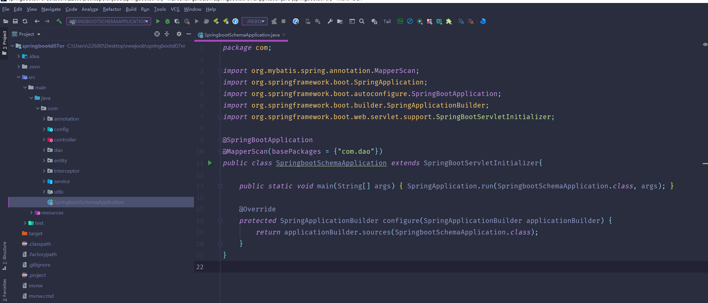
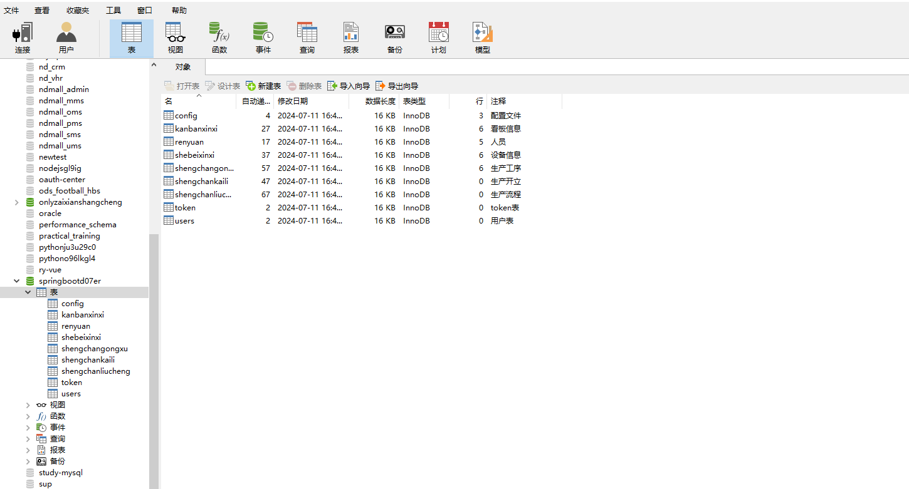
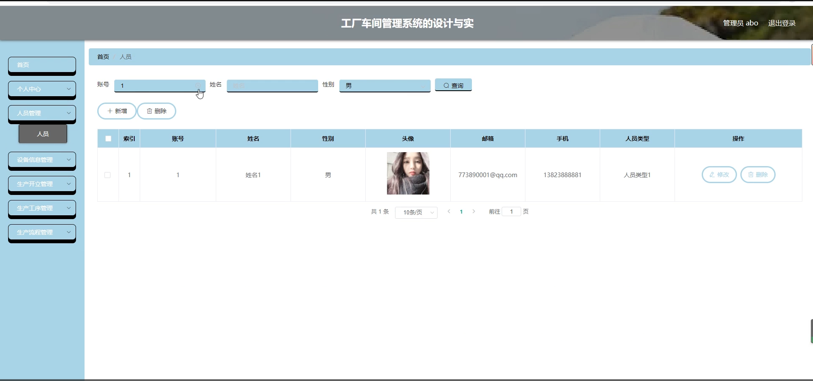
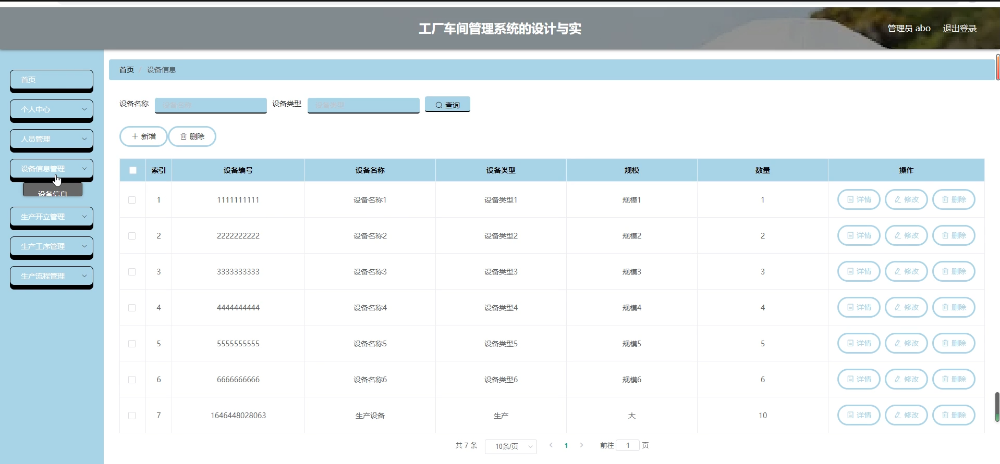
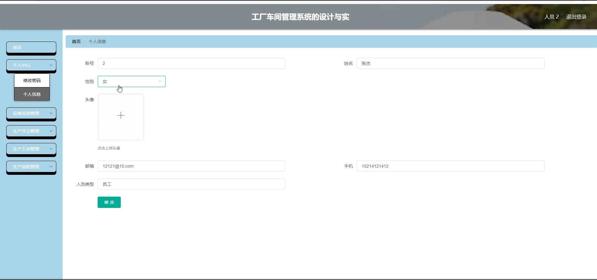
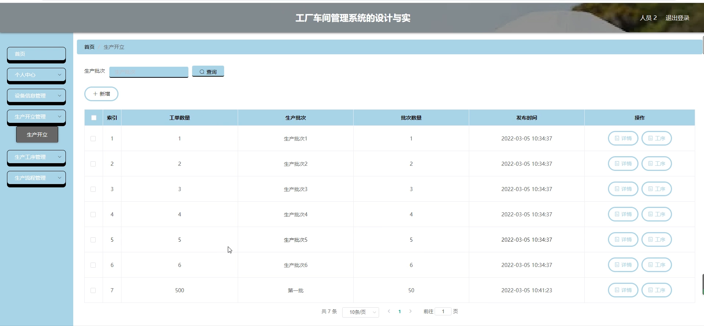
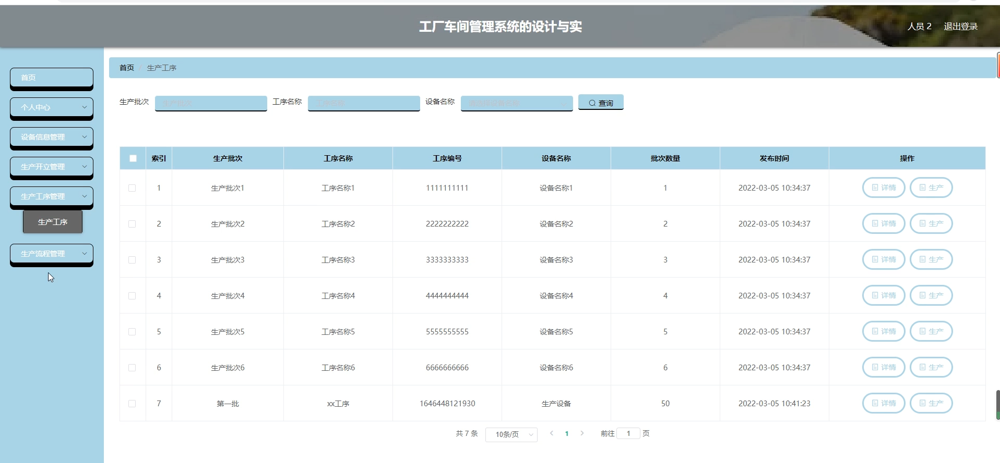
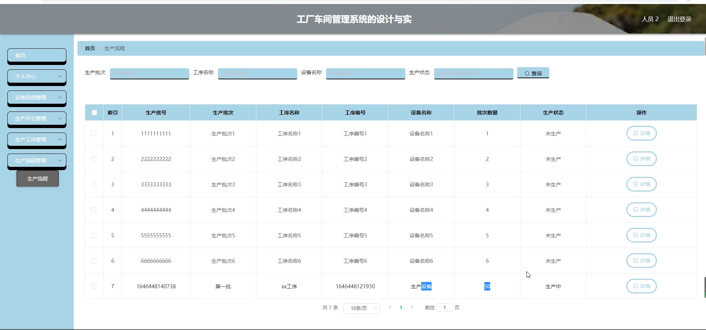
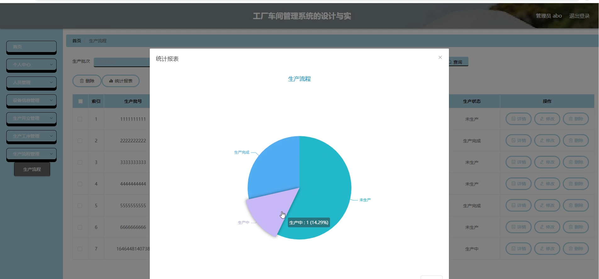

# 基于vue的工厂车间管理系统

#### 介绍

在现代制造业的快速发展中，为了提高工厂车间的生产效率、优化资源配置和保障生产质量，我们开发了这套基于 Vue 的工厂车间管理系统。该系统旨在通过数字化和信息化的手段，对车间的生产运营进行全面、精准的管理，以满足企业日益增长的生产需求和市场竞争的挑战。

#### 技术栈

后端技术栈：Springboot+Mysql+Maven

前端技术栈：Vue+Html+Css+Javascript+ElementUI

开发工具：Idea+Vscode+Navicate

#### 系统功能介绍

（一）管理员角色  
个人中心：管理员可以在个人中心查看和修改自己的个人信息，包括登录密码、联系方式等，同时可以查看系统操作记录和重要通知。  
人员管理：对车间员工的信息进行全面管理，包括员工的基本资料、岗位分配、考勤记录、绩效评估等。可以进行员工的新增、删除、修改和查询操作，以便合理安排人力资源，提高员工工作效率。  
设备信息管理：负责工厂车间内所有设备的详细信息管理，包括设备的型号、编号、购买日期、维护记录、维修计划等。能够对设备进行添加、删除、修改操作，及时掌握设备的运行状况，确保设备的正常运行，提高设备利用率。  
生产开立管理：制定生产计划，包括产品种类、数量、生产周期等。可以根据市场需求和企业实际情况调整生产计划，确保生产任务的顺利完成。  
生产工序管理：对产品的生产工序进行规划和设置，包括每个工序的操作步骤、所需工时、质量标准等。能够优化工序流程，提高生产效率，保证产品质量的稳定性。  
生产流程管理：对整个生产流程进行监控和管理，包括原材料采购、生产加工、质量检测、成品入库等环节。可以及时发现生产过程中的问题，采取相应的措施进行解决，确保生产流程的顺畅。  

（二）员工角色  
个人中心：员工在个人中心可以查看自己的个人信息、工作安排、考勤记录和绩效情况等。  
设备信息管理：查看设备的相关信息，如设备的使用说明、维护要求等，在使用设备时遵循规定的操作流程，并及时上报设备故障或异常情况。  
生产开立管理：了解自己所参与的生产任务的详细信息，包括生产的产品、数量、交付日期等，按照生产计划进行生产作业。  
生产工序管理：熟悉自己负责的工序的操作规范和质量标准，严格按照工序要求进行生产，确保工序的质量和效率。  
生产流程管理：掌握整个生产流程的进展情况，了解上下游工序的衔接，积极配合其他环节的工作，保证生产流程的顺利进行。  

#### 系统作用

提升生产效率  
优化生产流程和工序安排，减少生产中的等待时间和重复劳动，提高设备利用率和人员工作效率。  
保证产品质量  
通过严格的工序管理和质量监控，确保产品符合质量标准，减少次品和废品的产生。  
合理配置资源  
基于人员和设备的有效管理，实现人力资源和设备资源的合理分配，避免资源闲置和浪费。  
增强决策支持  
为管理层提供准确的生产数据和分析报告，有助于制定科学的生产策略和决策。  
促进信息共享  
使管理员和员工能够及时获取所需的生产信息，加强部门之间的协作和沟通。  

#### 系统功能截图

代码结构

数据库表

登录

管理员端人员管理

设备信息管理

人员端个人信息

生产开立管理

生产工序管理

生产流程管理

生产流程统计

#### 总结

基于 Vue 的工厂车间管理系统，通过为管理员和员工提供不同但相互关联的功能模块，实现了车间生产管理的数字化、规范化和智能化。该系统有助于提高工厂的生产管理水平，增强企业的市场竞争力，推动企业的可持续发展。

#### 使用说明

创建数据库，执行数据库脚本 修改jdbc数据库连接参数 下载安装maven依赖jar 启动idea中的springboot项目

后台地址
http://localhost:8080/springbootd07er/admin/dist/index.html

管理员  abo 密码 abo